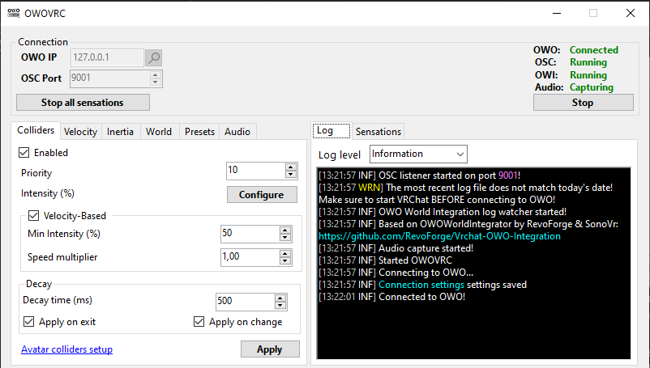

# OWO VRChat integration

Yet another VRChat integration for the [OWO Skin](https://owogame.com/).

## Features
* Velocity-based wind simulation (no setup required!)
* Collider based-feedback
* Velocity-based collider feedback
* Support for OWO enabled worlds ([OWO World Integrator](https://github.com/RevoForge/Vrchat-OWO-Integration))
* Custom sensations triggered via OSC

## Usage

Please refer to the [Wiki](https://github.com/sync1211/owoskin-vrc/wiki) for a quickstart guide and setup instructions.

## Credits

* [Shadoki's OWO integration](https://github.com/shadorki/vrc-owo-suit)
* [RevoForge & SonoVr's OWO World Integration](https://github.com/RevoForge/Vrchat-OWO-Integration)
* [McSolo's OwoAdvancedSensationBuilder](https://github.com/joeloestreich/OwoAdvancedSensationBuilderNet8Demo)

## Dislcaimer

This is a community project; I am not affiliated with OWOGame.

All brand icons belong to their respective owners.
